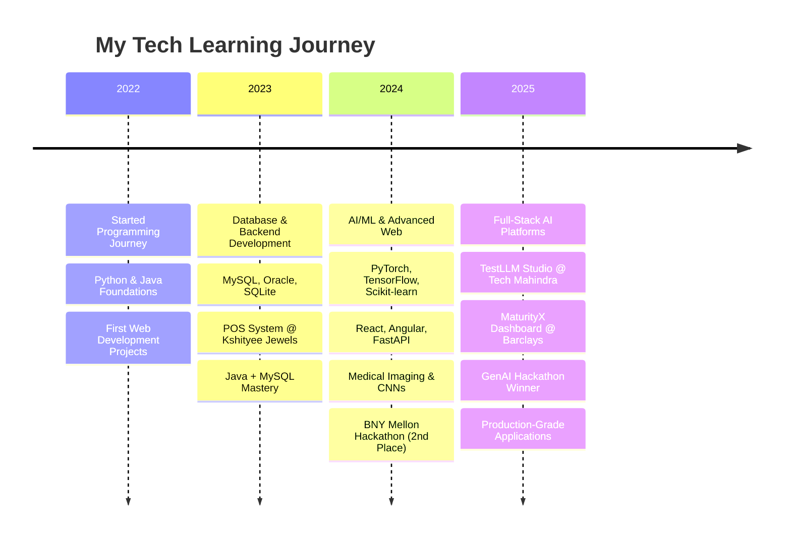

<h1 align="center">Hi, I'm Chinmayee 👋</h1>
<h3 align="center">AI/ML Engineer | Full-Stack Developer</h3>
<h4 align="center">AI Intern @Maker's Lab TechM | Future SDE @Barclays Bank PLC | Pune, India </h4>

  I build intelligent, end-to-end applications, transforming complex data into scalable software. My experience ranges from developing production-grade dashboards at <b>Barclays</b> to creating AI-powered fine-tuning platforms at <b>Tech Mahindra's Maker's Lab</b>.

---

## 🏆 Highlights and Leadership

- **Hackathon Winner:** Won the **Barclays Internal Hackathon 2025** by designing a GenAI assistant for MSME loan scoring and document validation.
- 🚀 **Shipped a Full-Stack AI Platform:** Built TestLLM Studio, an end-to-end model fine-tuning platform, during my internship at Tech Mahindra.
- **Top Performer:** Placed **2nd out of 200+ teams** at the BNY Mellon Hackathon 2024 with a Java-based social music player.
- **Delivered Business Impact:** Reduced manual errors by **60%** and doubled online revenue by creating a POS system for Kshityee Jewels.
- **CEO @ E-Cell Yukta** – Organized Empulse 2025, largest in 8 years
- Led team to NEC Finals @ IIT Bombay (2024)
- BNY Mellon Career Catalyst Mentee (2024)
- Providence TechSphere: Healthcare data analytics
- DSA Craft 2024 Hackathon – 2nd place with VIBIN' Music Player

---

## 💻 My Journey & Tech Stack

### 🗓️ **Tech Evolution Timeline**

### 🎯 **Current Tech Stack**

<table>
<tr>

<!-- Foundations -->
<td align="center" width="33%">

<h4 style="color:white; margin-bottom:15px;">🏗️ Foundations</h4>

 Python 
 Java 
 C++ 
 C

</td>

<!-- Web Development -->
<td align="center" width="33%">

<h4 style="color:white; margin-bottom:15px;">🌐 Web Development</h4>

 React 
 Angular 
 FastAPI 
 JavaScript 
 TypeScript

</td>

<!-- Databases -->
<td align="center" width="33%">

<h4 style="color:white; margin-bottom:15px;">🗄️ Databases</h4>

 MySQL 
 Oracle 
 SQLite 
 MongoDB 
 Firebase

</td>
</tr>

<tr>
<!-- AI/ML -->
<td align="center" width="33%">

<h4 style="color:white; margin-bottom:15px;">🤖 AI/ML</h4>

 PyTorch 
 TensorFlow 
 Keras 
 Hugging Face 
 Scikit-learn

</td>

<!-- NLP & CV -->
<td align="center" width="33%">

<h4 style="color:white; margin-bottom:15px;">🧠 NLP & CV</h4>

 NLTK 
 SpaCy 
 OpenCV

</td>

<!-- Mobile & Tools -->
<td align="center" width="33%">

<h4 style="color:white; margin-bottom:15px;">📱 Mobile & Tools</h4>

 Android 
 Git 
 Docker 
 Kubernetes 
 VS Code

</td>

</tr>
</table>

## 🚀 Project Showcase

<table>
<tr>
<td align="center" width="33%">

<h4 style="color: white; margin: 0 0 10px 0; font-size: 16px;">TestLLM Studio</h4>

AI Model Fine-Tuning Platform

Built an end-to-end platform for AI model fine-tuning (React frontend, FastAPI backend, Streamlit UI). Automated dataset pipelines and implemented LoRA-based fine-tuning.

React
FastAPI
Streamlit

[Private - Tech Mahindra Internship]

</td>

<td align="center" width="33%">

<h4 style="color: white; margin: 0 0 10px 0; font-size: 16px;">MaturityX</h4>

Application Monitoring Dashboard

Developed a full-stack dashboard to monitor application maturity across business units. Implemented role-based authentication and automated Excel → DB pipelines.

FastAPI
Angular
Oracle

[Private - Barclays Internship]

</td>

<td align="center" width="33%">

<h4 style="color: white; margin: 0 0 10px 0; font-size: 16px;">MSME GenAI Assistant</h4>

Barclays Hackathon Winner

Designed a GenAI solution for MSMEs including loan scoring, finance strategy, and document validation. Won the Barclays Internal Hackathon 2025.

GenAI
Python
ML

[Hackathon Winner]

</td>
</tr>
</table>

<a href="https://github.com/chinmayee-s-r?tab=repositories" target="_blank">
<button style="background: linear-gradient(135deg, #667eea, #764ba2); color: white; border: none; padding: 12px 24px; border-radius: 25px; font-size: 14px; font-weight: bold; cursor: pointer; box-shadow: 0 4px 15px rgba(0,0,0,0.2);">
View More Projects
</button>
</a>

## 📊 GitHub Stats

