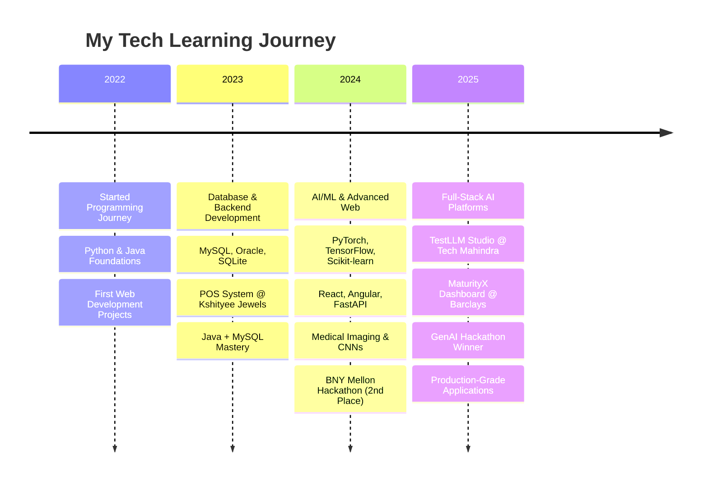
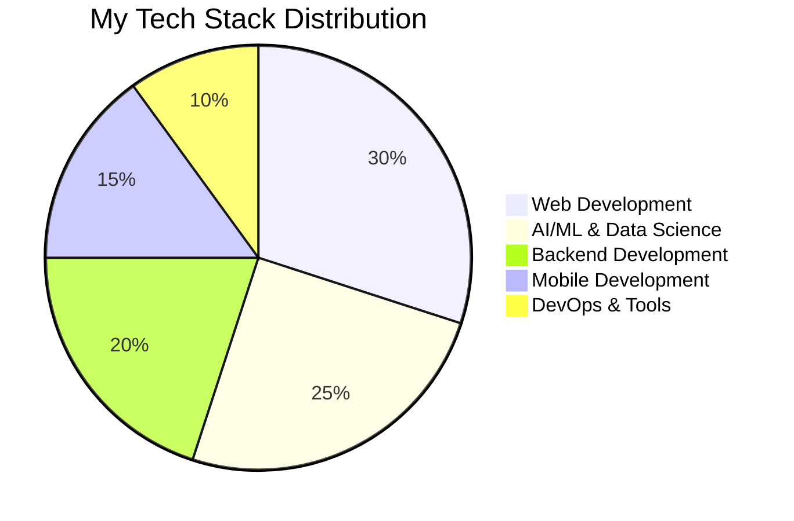
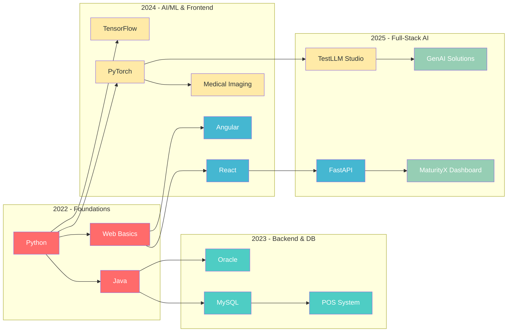

<h1 align="center">Hi, I'm Chinmayee 👋</h1>
<h3 align="center">AI/ML Engineer | Full-Stack Developer</h3>

  I build intelligent, end-to-end applications, transforming complex data into scalable software. My experience ranges from developing production-grade dashboards at <b>Barclays</b> to creating AI-powered fine-tuning platforms at <b>Tech Mahindra's Maker's Lab</b>.

---

### ✨ Key Highlights
- �� **Hackathon Winner:** Won the **Barclays Internal Hackathon 2025** by designing a GenAI assistant for MSME loan scoring and document validation.
- 🚀 **Shipped a Full-Stack AI Platform:** Built TestLLM Studio, an end-to-end model fine-tuning platform, during my internship at Tech Mahindra.
- �� **Top Performer:** Placed **2nd out of 200+ teams** at the BNY Mellon Hackathon 2024 with a Java-based social music player.
- �� **Delivered Business Impact:** Reduced manual errors by **60%** and doubled online revenue by creating a POS system for Kshityee Jewels.

---

## 💻 My Tech Journey & Stack

### 🗓️ **Tech Evolution Timeline**

### 🎯 **Current Tech Stack**

#### ��️ **Core Languages**

#### 🌐 **Web Technologies**

#### �� **AI/ML Frameworks**

#### 🗄️ **Databases**

#### 🛠️ **Tools & DevOps**

### 📊 **Skill Distribution**

### 🎯 **Proficiency Levels**

#### 🏆 **Expert Level (90%+)**

#### 🚀 **Advanced Level (80-89%)**

#### 💪 **Intermediate Level (70-79%)**

### 🌟 **Learning Focus Areas**

#### 🎯 **Currently Learning**

#### 🔮 **Next Goals**

### �� **Tech Stack Evolution**

## 🚀 Project Showcase

### �� TestLLM Studio – AI Model Fine-Tuning Platform (Internship @ Tech Mahindra)

  
  

    <strong>TestLLM Studio – AI Model Fine-Tuning Platform</strong> 
    Built an end-to-end platform for AI model fine-tuning (React frontend, FastAPI backend, Streamlit UI). 
    Automated dataset pipelines (scraping, Q&A gen, Whisper TTS). 
    Implemented LoRA-based fine-tuning with Unsloth & Hugging Face. 
    <em>[Repo: Private – Internship Project]</em>
  

### 📌 MaturityX – Application Monitoring Dashboard (Internship @ Barclays)

  
  

    <strong>MaturityX – Application Monitoring Dashboard</strong> 
    Developed a full-stack dashboard to monitor application maturity across business units. 
    Implemented role-based authentication and automated Excel → DB pipelines. 
    Tech Stack: FastAPI, Angular, SQLite, Oracle DB. 
    <em>[Repo: Private – Internship Project]</em>
  

�� View More Projects (2025, 2024, 2023)

### �� 2025

💳 MSME GenAI Assistant Ascend (Barclays Hackathon – Winner)

Designed a GenAI solution for MSMEs (loan scoring, finance strategy, document validation).

Won Barclays Internal Hackathon 2025.

[Hackathon Project]

🌐 Empulse 2025 – E-Cell Yukta Website

Designed and deployed the official website for Empulse 2025, the biggest E-Cell Yukta event.

Improved outreach and collaborations across multiple colleges.

[View Repo](https://github.com/chinmayee-s-r/empulse-2025)

### 📌 2024

📰 Fake News Detection & Bias Analysis

Achieved 99% accuracy in fake news detection (TF-IDF + Logistic Regression).

Analyzed 17K+ BBC articles for political bias.

[View Repo](https://github.com/chinmayee-s-r/fake-news-detection)

�� Medical Imaging & Diagnosis

Built CNNs achieving 95% accuracy for classification.

Detected fractures (93.65%) & brain tumors (85.17%).

Streamlit-based UI for real-time diagnosis.

[View Repo](https://github.com/chinmayee-s-r/medical-imaging)

�� Vision Enhancement for Driverless Cars (CAP)

Enhanced visibility by 90% in hazy conditions using Color Attenuation Prior.

Improved lane & obstacle recognition for real-time navigation.

[View Repo](https://github.com/chinmayee-s-r/vision-enhancement)

🎵 VIBIN' Music Player (BNY Mellon Hackathon – 2nd Place)

Built a Java-based music player with social features (Friendship Meter, Music Match).

Ranked 2nd out of 200+ teams at BNY Mellon Hackathon 2024.

[View Repo](https://github.com/chinmayee-s-r/vibin-music-player)

👵 Sahara: Elder Care & Safety App

Android + Firebase app with SOS alerts and secure medical record storage.

[View Repo](https://github.com/chinmayee-s-r/sahara-elder-care)

### �� 2023

🛒 POS & Resource Management System (Internship @ Kshityee Jewels)

Created POS system for 150+ SKUs (Java + MySQL).

Doubled online revenue & reduced manual errors by 60%.

[View Repo](https://github.com/chinmayee-s-r/pos-system)

🛍️ Electronics Store DBMS Project

Developed a database system for electronic store management.

Tech: MySQL, JDBC.

[View Repo](https://github.com/chinmayee-s-r/electronics-store-dbms)

## 📌 Career Timeline

## 🏆 Highlights & Leadership

- **CEO @ E-Cell Yukta** – Organized Empulse 2025, largest in 8 years
- Led team to NEC Finals @ IIT Bombay (2024)
- BNY Mellon Career Catalyst Mentee (2024)
- Providence TechSphere: Healthcare data analytics
- DSA Craft 2024 Hackathon – 2nd place with VIBIN' Music Player

## 📊 GitHub Stats

## 🌐 Connect With Me

